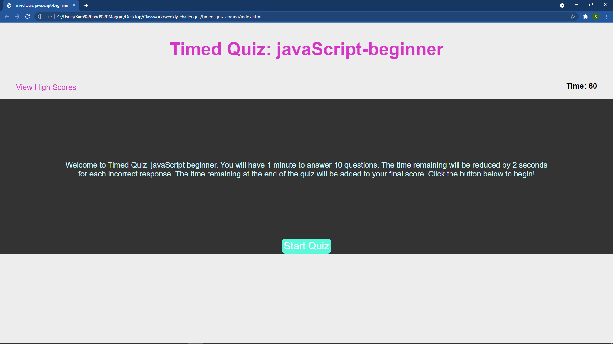

# timed-quiz-coding
Class assignment to create a timed quiz such as aspiring web developers might face in a job application.

## Motivation, What I Did, and What I Learned
This project was a challenge, but it went more smoothly than the previous one. I enjoyed building it from scratch. Things basically went as planned. At the beginning, I was trying to do it all on one page, and not having much luck. I ended up navigating between four separate html pages, which worked out really well. I used a youtube video by Brian Design as inspiration and studying his work helped me with some of the js logic. My tutor walked me through the saving to localStorage part. I feel like I'm not where I want to be, but I am gaining. Every time I work through these challenges, I am getting more familiar with the way things work. I am also becoming more able to seek out answers on my own by searching the internet or studying through documentation. The css part, in particular, came much easier. I used the dev tools a lot to see how the various elements functioned together on each page and tinkered with the styles. I feel like this repo could be reused with different headings and different questions to easily make a variety of quizzes on any number of subjects. It could be lengthened easily as well, and the time and score functionality could be easily altered to fit each usage. Overall, I am very happy with this project. I know I still have much to learn and much work in front of me before I am a competent programmer/developer. I do enjoy the time spent, though, and I feel like it is paying off as my skills and knowledge improve.

## Links
Below is a link to the deployed page and a screenshot of how it looks in a browser.

